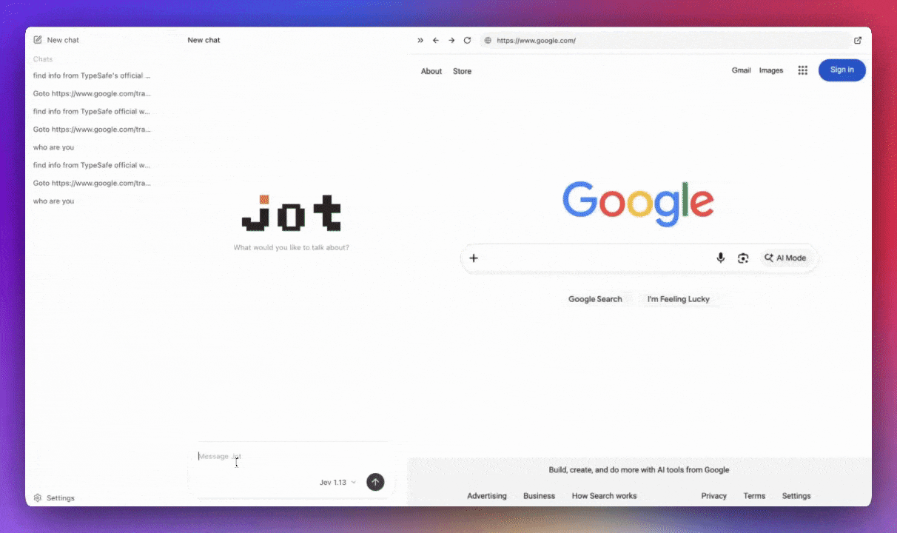

<div align="center">

<picture>
  <source media="(prefers-color-scheme: dark)" srcset="packages/ui/public/brand/jot-wordmark-dark.svg">
  <source media="(prefers-color-scheme: light)" srcset="packages/ui/public/brand/jot-wordmark.svg">
  
</picture>

### The first general-purpose System One agent for Jev

Jev picks the next move. Jot runs the loop.

[](https://github.com/runta-dev/jot/stargazers)
[](https://github.com/runta-dev/jot/issues)
[](https://github.com/runta-dev/jot/commits)
[](https://www.typescriptlang.org/)
[](https://nodejs.org/)
[](https://www.apple.com/macos/)
[](https://typesafe.ai/)

[Quick start](#quick-start) · [The loop](#the-loop) · [Packages](#packages)

</div>

<p align="center">
  
</p>

## What it does

Jot is the first general-purpose [System One](https://typesafe.ai/) agent for [Jev](https://typesafe.ai/). Jev chooses tools and arguments. Jot runs the loop: execute, put the real results back into context, ask Jev again until it can reply.

You see every tool call. Credentials stay on the server. Chats stay in this browser.

## The loop

```text
You → Jev chooses a tool → execute → tool result → Jev again → reply
```

```text
You: Add 6 and 7, then multiply by 2.

calculate({ left: "6", operator: "add", right: "7" })  → 13
calculate({ left: "13", operator: "multiply", right: "2" })  → 26

Jot: 26
```

The calculator does the math. Jev only decides the calls.

## Quick start

Needs Node.js, a [TypeSafe](https://typesafe.ai/) API key, and Apple Silicon with `uv` for local drafts.

```sh
npm install
cp .env.example .env   # set TYPESAFE_API_KEY
npm run draft:serve    # terminal 1
npm run dev            # terminal 2
```

Open [localhost:3000](http://localhost:3000). Loopback only.

```sh
npm test && npm run build
```

## Packages

```text
packages/ui          Chat UI and tool-call trace
packages/agent       Provider-independent loop
packages/jev-core    TypeSafe client and Jev text
server/              HTTP, Jev adapter, tools
```

UI talks to agent events. The loop does not import React or Jev. The server wires them.

## Credits

[TypeSafe / Jev](https://typesafe.ai/) · [pi](https://github.com/earendil-works/pi) · [Errand](https://runerrand.dev/) · [FrequencyWords](https://github.com/hermitdave/FrequencyWords) · [jsRealB](https://github.com/rali-udem/jsRealB)

Jot is independent and not affiliated with TypeSafe. Jev is the model name.
